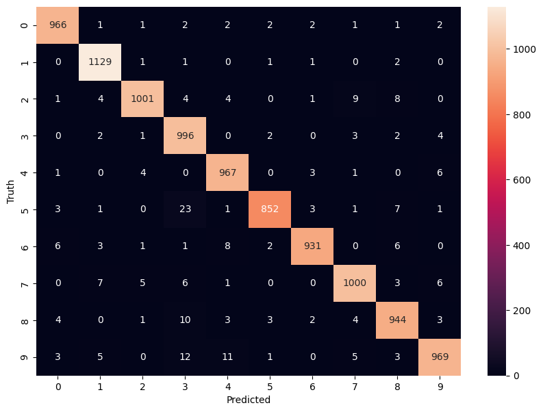

# MNIST Handwritten Digit Classification

This project demonstrates the use of a neural network for classifying handwritten digits from the MNIST dataset using TensorFlow and Keras. The model is trained to recognize digits (0-9) from images of handwritten digits. It includes both a simple model and an improved version with additional layers.

## Table of Contents
- [Project Overview](#project-overview)
- [Dataset](#dataset)
- [Model Architecture](#model-architecture)
- [Installation](#installation)
- [Usage](#usage)
- [Results](#results)
- [Improvements](#improvements)
- [Confusion Matrix](#confusion-matrix)
- [Contributing](#contributing)

## Project Overview

This project uses a neural network to classify the MNIST dataset, which consists of 70,000 grayscale images of handwritten digits (28x28 pixels). A basic neural network model is first trained on the data, followed by an improved model with a hidden layer for better performance. Both models are evaluated, and their performance is visualized using a confusion matrix.

## Dataset

The MNIST dataset is one of the most widely used datasets for digit classification. It consists of:
- 60,000 training images
- 10,000 test images

Each image represents a handwritten digit (0-9), and the goal is to correctly classify the digits using a neural network.

## Model Architecture

### Basic Model:
- **Input layer**: Flattened 28x28 pixel images into a 784-dimensional vector.
- **Output layer**: Dense layer with 10 neurons (for 10 classes) and `sigmoid` activation function.

### Improved Model:
- **Hidden layer**: Dense layer with 100 neurons and `ReLU` activation function.
- **Output layer**: Dense layer with 10 neurons and `sigmoid` activation function.

## Installation

To run this project, you'll need Python and the following dependencies:

1. TensorFlow
2. Keras (bundled with TensorFlow)
3. Matplotlib
4. Numpy
5. Seaborn

You can install the dependencies using the following command:

```bash
pip install tensorflow matplotlib numpy seaborn
```

## Usage

1. Clone the repository:
   ```bash
   git clone https://github.com/your-username/mnist-classification.git
   cd mnist-classification
   ```

2. Run the Python script:
   ```bash
   python mnist_classification.py
   ```

### Key Steps in the Script:
- Load and preprocess the MNIST dataset.
- Train both a basic and an improved neural network model.
- Evaluate model performance.
- Visualize predictions and display the confusion matrix.

## Results

The test accuracy achieved by the basic model and the improved model are shown below:

- **Basic Model**: Accuracy of around ~92%
- **Improved Model**: Accuracy of around ~97%

These accuracies can vary slightly depending on the system and random initialization of weights.

## Improvements

The improved model introduces an additional hidden layer with 100 neurons and a `ReLU` activation function. This significantly improves the model's performance compared to the basic model, which had only one output layer.

## Confusion Matrix

A confusion matrix is used to evaluate the performance of the improved model. It visualizes the number of correct and incorrect predictions for each digit.

  
*(Example confusion matrix for the improved model)*

## Contributing

Contributions are welcome! If you'd like to contribute, feel free to fork the repository and submit a pull request.

1. Fork the repository.
2. Create a new branch: `git checkout -b feature/your-feature`.
3. Make your changes and commit them: `git commit -m 'Add some feature'`.
4. Push to the branch: `git push origin feature/your-feature`.
5. Submit a pull request.

